# NothingDNS Architecture

## Table of Contents

1. [Overview](#1-overview)
2. [System Architecture](#2-system-architecture)
3. [Request Processing Pipeline](#3-request-processing-pipeline)
4. [Transport Layer](#4-transport-layer)
5. [Protocol Layer](#5-protocol-layer)
6. [Storage Layer](#6-storage-layer)
7. [Manager Architecture](#7-manager-architecture)
8. [Cluster & High Availability](#8-cluster--high-availability)
9. [API Layer](#9-api-layer)
10. [Security Architecture](#10-security-architecture)
11. [DNSSEC](#11-dnssec)
12. [Operational Features](#12-operational-features)

---

## 1. Overview

NothingDNS is a production-grade DNS server written in Go with zero external dependencies. It provides authoritative DNS, recursive resolution, and full transport support (UDP, TCP, TLS, DoH, DoQ, WebSocket, XoT).

### Design Principles

- **Zero external dependencies** — Go stdlib only (`golang.org/x/sys` for platform-specific socket ops)
- **Single binary** — All components compiled into `cmd/nothingdns/`
- **Single binary deployment** — CLI companion `cmd/dnsctl/` for management
- **Hot config reload** — SIGHUP reloads zones, blocklists, RPZ rules, TLS certs without downtime
- **Multi-stage pipeline** — 21-stage integrated handler for all DNS processing

### Supported RFCs

| Category | RFCs |
|----------|------|
| DNS Core | 1035, 1996, 2136, 2308, 2535, 3007, 3190, 3596, 3597, 3645, 3755, 4025, 4124, 4302, 4303, 4393, 4472, 4635, 5011, 5155, 5452, 5891, 5892, 5936, 5966, 6604, 6673, 6725, 6761, 6762, 6763, 6891, 6895, 6975, 7043, 7314, 7583, 7766, 7816, 7858, 7910, 8162, 8198, 8200, 8324, 8482, 8484, 8767, 8805, 8914, 8976, 9076, 9103, 9218, 9250, 9293 |
| DNSSEC | 4033, 4034, 4035, 4509, 4641, 5155, 5702, 6605, 6781, 6840, 6844, 6944, 6973, 6981, 7344, 7583, 8085, 8624, 9078 |
| DNS Privacy | 7858, 8094, 8310, 8441, 8484, 9100, 9230, 9250, 9314 |

---

## 2. System Architecture

### High-Level Component Diagram

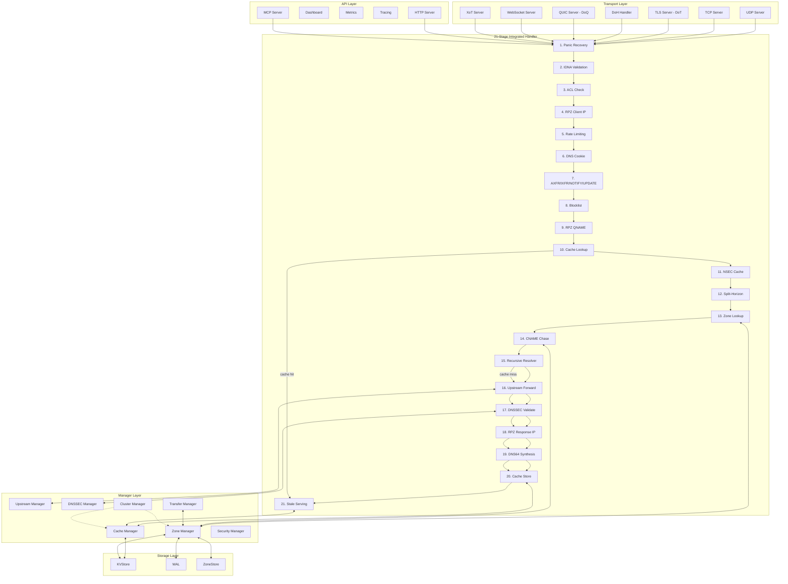

### Package Map

```
cmd/
├── nothingdns/          # Main DNS server binary
│   ├── main.go          # Entry point, signal handling
│   ├── handler.go       # Integrated 21-stage handler (1255 lines)
│   ├── cache_manager.go
│   ├── upstream_manager.go
│   ├── zone_manager.go
│   ├── security_manager.go
│   ├── dnssec_manager.go
│   ├── cluster_manager.go
│   └── transfer_manager.go
└── dnsctl/              # CLI management tool

internal/
├── api/                 # REST API server + OpenAPI
├── audit/               # Structured query audit logging
├── auth/                # JWT multi-user auth with RBAC
├── blocklist/           # Domain blocklist engine
├── cache/               # LRU cache with TTL, NSEC, stale serving
├── catalog/             # Zone catalog (RFC 9432)
├── cluster/             # Gossip (SWIM) + Raft consensus
│   └── raft/            # Raft consensus implementation
├── config/              # Custom YAML parser
├── dashboard/           # Embedded React 19 SPA
├── dns64/               # DNS64/NAT64 synthesis (RFC 6147)
├── dnscookie/           # DNS Cookies (RFC 7873)
├── dnssec/              # DNSSEC validation, signing, key rollover
├── doh/                 # DNS over HTTPS (RFC 8484)
├── dso/                 # DNS Stateful Operations (RFC 8490)
├── e2e/                 # End-to-end tests
├── filter/              # ACL, rate limiting, RRL, split-horizon
├── geodns/              # GeoIP DNS with MMDB
├── idna/                # IDNA validation (RFC 5891)
├── load/                # Load balancing
├── memory/              # Runtime memory monitoring
├── metrics/             # Prometheus metrics
├── odoh/                # Oblivious DoH (RFC 9230)
├── otel/                # OpenTelemetry tracing
├── protocol/            # DNS wire protocol (RFC 1035)
├── quic/                # DNS over QUIC (RFC 9250)
├── resolver/            # Iterative recursive resolver
├── rpz/                 # Response Policy Zones
├── server/              # UDP, TCP, TLS transport handlers
├── storage/             # KV store, WAL, TLV serialization
├── transfer/            # AXFR, IXFR, NOTIFY, DDNS, XoT
├── upstream/            # Upstream forwarding, health checks
├── websocket/           # WebSocket for live query streaming
└── zone/                # BIND zone parser, radix tree, ZONEMD
```

---

## 3. Request Processing Pipeline

The core `integratedHandler.ServeDNS()` method processes all DNS queries through 21 sequential stages:

```mermaid
flowchart LR
    Q[Query] --> P1
    P1[1. Panic Recovery] --> P2
    P2[2. IDNA Validation] --> P3
    P3[3. ACL Check] --> P4
    P4[4. RPZ Client IP] --> P5
    P5[5. Rate Limiting] --> P6
    P6[6. DNS Cookie] --> P7
    P7[7. Special Types] --> P8
    P8[8. Blocklist] --> P9
    P9[9. RPZ QNAME] --> P10
    P10[10. Cache Lookup] --> |hit| E[Response]
    P10 --> |miss| P11
    P11[11. NSEC Cache] --> P12
    P12[12. Split-Horizon] --> P13
    P13[13. Zone Lookup] --> |found| E
    P13 --> |miss| P14
    P14[14. CNAME Chase] --> |found| E
    P14 --> P15
    P15[15. Resolver] --> P16
    P16[16. Upstream] --> P17
    P17[17. DNSSEC] --> P18
    P18[18. RPZ Response IP] --> P19
    P19[19. DNS64] --> P20
    P20[20. Cache Store] --> P21
    P21[21. Stale Serving] --> E
```

### Stage Details

| Stage | Component | RFC | Description |
|-------|-----------|-----|-------------|
| 1 | `defer recover()` | — | Recovers panics, returns SERVFAIL |
| 2 | `idna.Validate()` | 5891 | Validates internationalized domain names |
| 3 | `ACLChecker.Check()` | — | IP allow/deny by CIDR |
| 4 | `RPZEngine.CheckClientIP()` | — | RPZ client-IP trigger |
| 5 | `RateLimiter.Allow()` | — | Per-IP token bucket rate limiting |
| 6 | `CookieJar.Validate()` | 7873 | DNS Cookie anti-spoofing validation |
| 7 | `AXFR/IXFR/NOTIFY/UPDATE` | 1996, 2136 | Special request type handlers |
| 8 | `Blocklist.Check()` | — | Returns NXDOMAIN with EDE Filtered |
| 9 | `RPZEngine.CheckQNAME()` | — | RPZ QNAME trigger policy |
| 10 | `Cache.Get()` | 2308 | Positive cache hit returns immediately |
| 11 | `NSECCache.Synthesize()` | 8198 | Synthesize NXDOMAIN from cached NSEC |
| 12 | `SplitHorizon.Resolve()` | — | View-based zone selection by client IP |
| 13 | `RadixTree.Match()` | — | O(log n) authoritative zone lookup |
| 14 | `CNAMEChase.Follow()` | — | Follow CNAME chains within zones |
| 15 | `Resolver.Resolve()` | 7816 | Iterative recursive resolution |
| 16 | `UpstreamClient.Forward()` | — | Load-balanced upstream forwarding |
| 17 | `Validator.Validate()` | 4035 | DNSSEC signature validation |
| 18 | `RPZEngine.CheckResponseIP()` | — | RPZ response-IP trigger |
| 19 | `DNS64Synthesizer.Synthesize()` | 6147 | AAAA synthesis from A record |
| 20 | `Cache.Set()` | 2308 | Cache positive or negative response |
| 21 | `StaleCache.Serve()` | 8767 | Serve stale entries on upstream failure |

### Cache Key Design

```go
// Cache key includes DO bit (RFC 5011) to fix VULN-060
key := fmt.Sprintf("%s|%d|%d|%d", qname, qtype, qclass, doBit)
```

---

## 4. Transport Layer

### Transport Architecture

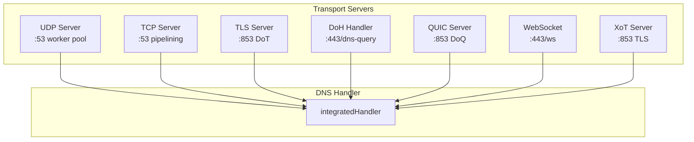

### UDP Server

- **Worker pool**: `runtime.NumCPU() * 4` goroutines
- **Per-IP rate limiter**: 100 qps, 50k max entries, sliding window
- **Buffer pooling**: `sync.Pool` for zero-alloc packet processing
- **SO_REUSEPORT**: Multi-core scalability on Linux
- **Truncation**: Record-boundary-aware, removes answers from end

```go
type UDPServer struct {
    addr         string
    handler      Handler
    conn         UDPConn
    workers      int
    rateLimiter  *rateLimiter
    bufferPool   sync.Pool  // []byte
    responsePool sync.Pool  // []byte
}
```

### TCP Server

- **Worker pool**: `runtime.NumCPU() * 2` goroutines
- **Connection limits**: 1000 global, 10 per-IP
- **RFC 7766 pipelining**: 16 concurrent in-flight queries per connection
- **2-byte length prefix** for DNS messages
- **Write serialization** via `sync.Mutex` for pipelining safety

### TLS Server (DoT)

- **RFC 8310 TLS profiles**: Opportunistic, Strict, Privacy
- **Dynamic certificate reload** via `GetCertificate` callback
- **ALPN**: `dot` for strict, `dot`, `dns` for opportunistic
- **TLS 1.3 only** (minimum version)
- **Cipher suites per RFC 7525**

### DoH Handler

- **GET**: Base64url-encoded query (`?dns=` parameter)
- **POST**: `application/dns-message` content type
- **JSON API**: Google/Cloudflare compatible via `Accept: application/dns-json`
- **RFC 7830 padding**: Rejection sampling for bias-free random size

### QUIC Server (DoQ)

- **RFC 9250**: DNS over QUIC
- **ALPN**: `doq`
- **Connection-level flow control**

### XoT Server

- **RFC 9103**: DNS Zone Transfer over TLS
- Reuses TLS server infrastructure

---

## 5. Protocol Layer

### Message Format

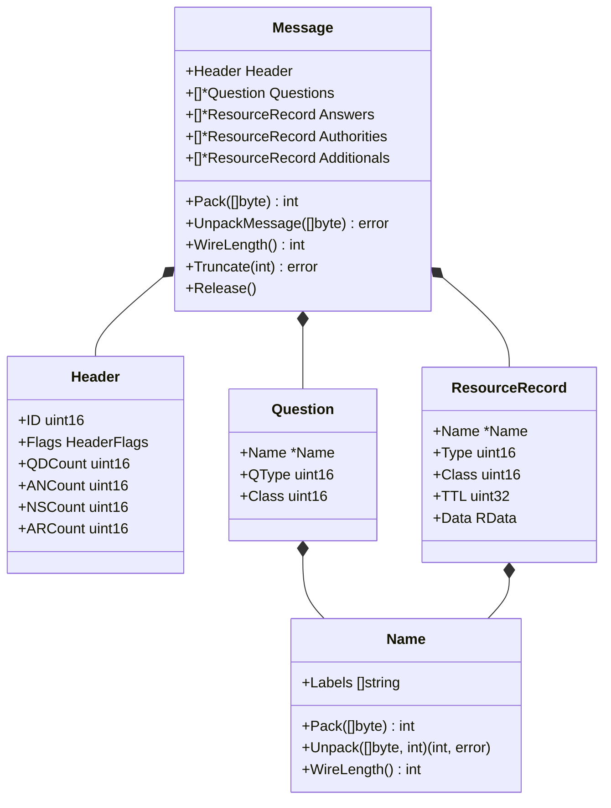

### Performance Features

- **`sync.Pool`** for message allocation/reuse
- **Compression map pooling** via `compressionPool`
- **Per-section record limits**: 256 questions, 512 answers/authorities/additionals
- **Maximum message size** validation during wire parsing

### DNSSEC Record Types

| File | Content |
|------|---------|
| `dnssec_dnskey.go` | DNSKEY (KSK, ZSK) |
| `dnssec_ds.go` | DS for chain of trust |
| `dnssec_nsec.go` | NSEC authenticated denial |
| `dnssec_nsec3.go` | NSEC3 with opt-out |
| `dnssec_rrsig.go` | RRSIG signatures |

### Extended DNS Errors

- RFC 8914 Extended DNS Errors with info codes (see `ede.go`)

---

## 6. Storage Layer

### KVStore

**Purpose**: ACID key-value store with optional HMAC integrity protection.

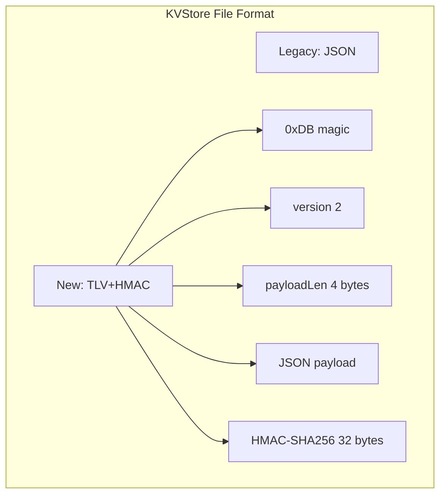

**Features**:
- **Bucket-based** organization (like boltdb)
- **Read/Write transactions** with locking
- **Atomic save** via temp file + rename
- **Optional SHA-256 HMAC** integrity protection (key must be 32 bytes)
- **Retry on save** if file is being replaced by concurrent save

### WAL (Write-Ahead Log)

**Format**: `[4 bytes CRC32][1 byte type][4 bytes length][N bytes data]`

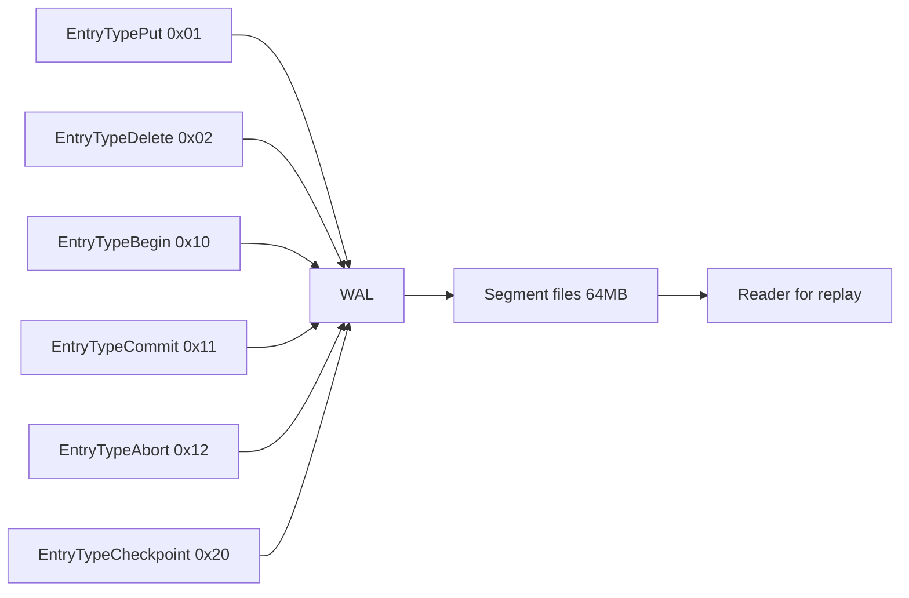

**Entry Types**:
- `EntryTypePut` (0x01)
- `EntryTypeDelete` (0x02)
- `EntryTypeBegin` (0x10)
- `EntryTypeCommit` (0x11)
- `EntryTypeAbort` (0x12)
- `EntryTypeCheckpoint` (0x20)

**Features**:
- Segment rotation at 64MB default
- Preallocation for segment files
- Batch append with atomic commit
- Periodic sync (100ms default)
- VULN-020: Rejects entries with length > `MaxSegmentSize` to prevent 4GiB allocation

### Transaction Model

```go
// Write transaction
err := kv.Update(func(tx *Tx) error {
    return tx.PutBucket("zones").Put("example.com", data)
})

// Read transaction
err := kv.View(func(tx *Tx) error {
    data := tx.GetBucket("zones").Get("example.com")
    return nil
})
```

---

## 7. Manager Architecture

### Manager Initialization Order

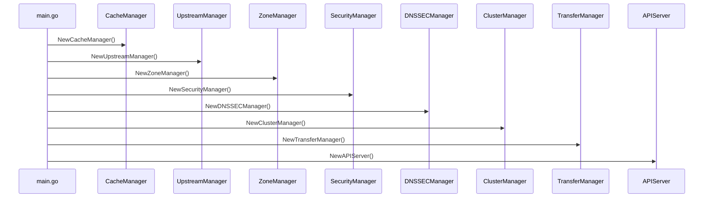

### CacheManager

```go
type CacheManager struct {
    Cache       *cache.Cache
    MemMonitor  *memory.Monitor
    logger      *util.Logger
    persistPath string
    stopCh      chan struct{}
}
```

**Features**:
- In-memory LRU cache with configurable capacity, TTLs, prefetch, serve-stale
- JSON file persistence with atomic rename
- KVStore persistence alternative
- Memory monitor with `CacheEvictor` for memory pressure response
- Periodic persistence (default 5 minutes)
- Load on startup for cache warming
- Cluster cache invalidation callback

### UpstreamManager

```go
type UpstreamManager struct {
    Client       *upstream.Client
    LoadBalancer *upstream.LoadBalancer
    Resolver     *resolver.Resolver
}
```

**Features**:
- Upstream `Client` for single upstream or load-balanced queries
- `LoadBalancer` for anycast/geo-distributed upstreams
- TCP connection pooling (`tcppool.go`)
- TXID randomization for spoof resistance (VULN-059)

### ZoneManager

```go
type ZoneManagerResult struct {
    Manager       *zone.Manager
    Zones         map[string]*zone.Zone
    ZoneFiles     map[string]string
    Signers       map[string]*dnssec.Signer
    KVPersistence *zone.KVPersistence
    KVStore       *storage.KVStore
}
```

**Features**:
- Parallel zone file loading
- ZONEMD computation (RFC 8976) if enabled
- DNSSEC signer initialization per zone
- KVStore + KVPersistence for runtime zone modifications

### SecurityManager

**Result Includes**:
- `Blocklist` — DNS query blocklist with stats
- `RPZEngine` — Response Policy Zones with multiple trigger types
- `GeoEngine` — Geographic DNS routing
- `ACLChecher` — IP-based access control
- `RateLimiter` — Per-IP rate limiting
- `RRL` — Response Rate Limiting for amplification detection

### DNSSECManager

```go
type DNSSECManager struct {
    Validator *dnssec.Validator
    Signers   map[string]*dnssec.Signer
}
```

### TransferManager

```go
type TransferManagerResult struct {
    AXFRServer    *transfer.AXFRServer
    IXFRServer    *transfer.IXFRServer
    NotifyHandler *transfer.NOTIFYSlaveHandler
    DDNSHandler   *transfer.DynamicDNSHandler
    SlaveManager  *transfer.SlaveManager
    JournalStore  *transfer.KVJournalStore
}
```

**Components**:
1. **AXFRServer** — Full zone transfers (TCP-only)
2. **IXFRServer** — Incremental zone transfers with journal
3. **NOTIFYSlaveHandler** — RFC 1996 NOTIFY handling
4. **DynamicDNSHandler** — RFC 2136 Dynamic Updates
5. **SlaveManager** — Automatic zone transfer from masters with TSIG
6. **KVJournalStore** — Persistent IXFR journal storage

---

## 8. Cluster & High Availability

### Cluster Architecture

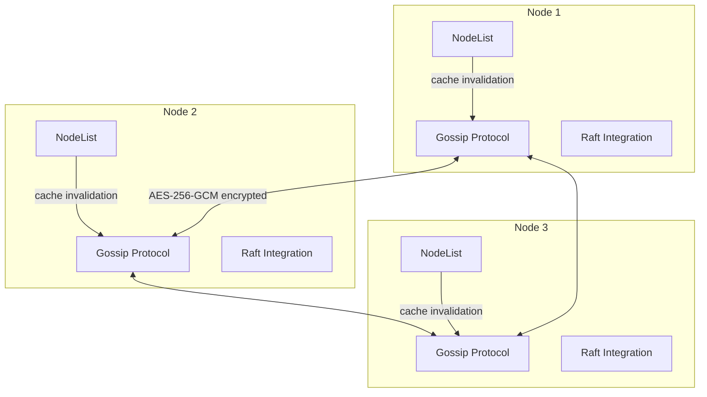

### Consensus Modes

| Mode | Protocol | Use Case |
|------|----------|----------|
| **SWIM** | Gossip-based failure detection | Default, eventual consistency |
| **Raft** | Strong consistency | Critical operations |

### SWIM Protocol

- **GossipProtocol** for failure detection and dissemination
- **AES-256-GCM encryption** when `EncryptionKey` is set
- **VULN-005**: Refuses to start multi-node without encryption key

**Broadcast Types**:
- Node stats
- Cache invalidation
- Zone update
- Config sync
- Draining state

### NodeList

**Node States**: Alive, Suspected, Dead, Draining

- Maintains cluster membership
- Health stats tracking per node
- `GetBest()` for health-weighted routing

### Gossip Payloads

```go
type ZoneUpdatePayload struct {
    ZoneName    string
    Action      string // "full", "add", "delete"
    Serial      uint32
    Records     []ZoneRecord
    DeletedKeys []string
    RawZone     []byte
}

type ConfigSyncPayload struct {
    ConfigSHA256  string
    Timestamp     time.Time
    NodeID        string
    ClusterConfig *ClusterConfigJSON
}

type ClusterMetricsPayload struct {
    QueriesTotal, QueriesPerSec float64
    CacheHits, CacheMisses     uint64
    LatencyMsAvg, LatencyMsP99 float64
    UptimeSeconds              uint64
}
```

### Cache Sync

- `InvalidateCache()` broadcasts to all peers
- Local invalidation on receive
- Per-IP rate limiting for UDP gossip

---

## 9. API Layer

### API Architecture

```mermaid
graph TB
    subgraph API["HTTP API Server"]
        HTTPS[http.Server]
        CORS[CORS Middleware]
        AUTH[Auth Middleware]
        RATE[Rate Limiter]
        SEC[Security Headers]
        
        HTTPS --> CORS
        CORS --> AUTH
        AUTH --> RATE
        RATE --> SEC
    end

    subgraph Endpoints["Endpoints"]
        DOH[DoH /dns-query]
        DOWS[DoWS /ws]
        ODOH[ODoH /.well-known/odoh-config]
        HEALTH[/health, /readyz, /livez]
        CLUSTER[/api/v1/cluster/*]
        ZONES[/api/v1/zones/*]
        CACHE[/api/v1/cache/*]
        DNSSEC[/api/v1/dnssec/*]
        AUTH[/api/v1/auth/*]
        CONFIG[/api/v1/config/*]
    end

    SEC --> DOH
    SEC --> DOWS
    SEC --> ODOH
    SEC --> HEALTH
    SEC --> CLUSTER
    SEC --> ZONES
    SEC --> CACHE
    SEC --> DNSSEC
    SEC --> AUTH
    SEC --> CONFIG
```

### Authentication

| Method | Type | Use Case |
|--------|------|----------|
| `auth_token` | Shared secret | Legacy |
| JWT | Token | API auth |
| Cookie | Session | Web UI |

**Roles**: `viewer` (1) < `operator` (2) < `admin` (3)

### Rate Limiting

- **Login**: 5 attempts, 5-minute lockout, progressive delay
- **VULN-068**: Per-(IP, username) pair lockout prevents username lockout DoS
- **API**: 100 req/min sliding window, 50k max IPs

### Security Headers

```
X-Frame-Options: DENY
X-Content-Type-Options: nosniff
Content-Security-Policy: ...
HSTS: ...
Referrer-Policy: ...
Permissions-Policy: ...
```

### DoH/DoWS/ODoH

**No authentication required** (VULN-044) — these are privacy-focused endpoints.

---

## 10. Security Architecture

### Security Components

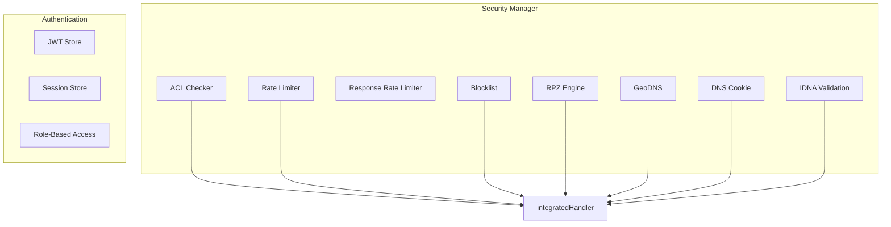

### RPZ Trigger Types

| Trigger | Description |
|---------|-------------|
| `TriggerQNAME` | Query name matching |
| `TriggerResponseIP` | IP addresses in response |
| `TriggerClientIP` | Client IP address |
| `TriggerNSDNAME` | Nameserver domain name |
| `TriggerNSIP` | Nameserver IP address |

### RPZ Policy Actions

- `NXDOMAIN` — Return NXDOMAIN
- `NODATA` — Return NODATA
- `CNAME` — Return custom CNAME
- `Override` — Override with custom record
- `Drop` — Drop the response
- `PassThrough` — Pass through without modification
- `TCPOnly` — Force TCP

### Vulnerabilities Mitigated

| ID | Description | Fix |
|----|-------------|-----|
| VULN-005 | Multi-node encryption mandatory | Cluster refuses without encryption key |
| VULN-020 | WAL length check | Rejects entries > MaxSegmentSize |
| VULN-044 | DoH/DoWS/ODoH no auth | No auth on these endpoints |
| VULN-059 | TXID randomization | Re-randomizes before forwarding |
| VULN-060 | Cache key includes DO bit | DO bit in cache key |
| VULN-063 | Reflected amplification | RRL superlative detection |
| VULN-068 | Username lockout DoS | Per-(IP, username) pair lockout |

---

## 11. DNSSEC

### Chain of Trust

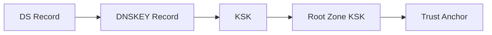

### Validation Result

| Result | Meaning |
|--------|---------|
| `Secure` | Validated successfully, AD bit set |
| `Bogus` | Validation failed, SERVFAIL returned |
| `Insecure` | No chain to trust anchor |
| `Indeterminate` | Cannot determine status |

### Signing

- **NSEC** — Authenticated denial of existence
- **NSEC3** — With opt-out for unsigned delegations
- **NSEC3PARAM** — Published for aggressive caching

### Key Rollover

- **ZSK**: Pre-publish and double-signature methods
- **KSK**: Double-RRset method

### Trust Anchor

- RFC 5011 trust anchor maintenance
- Root zone KSK handling

---

## 12. Operational Features

### Hot Config Reload

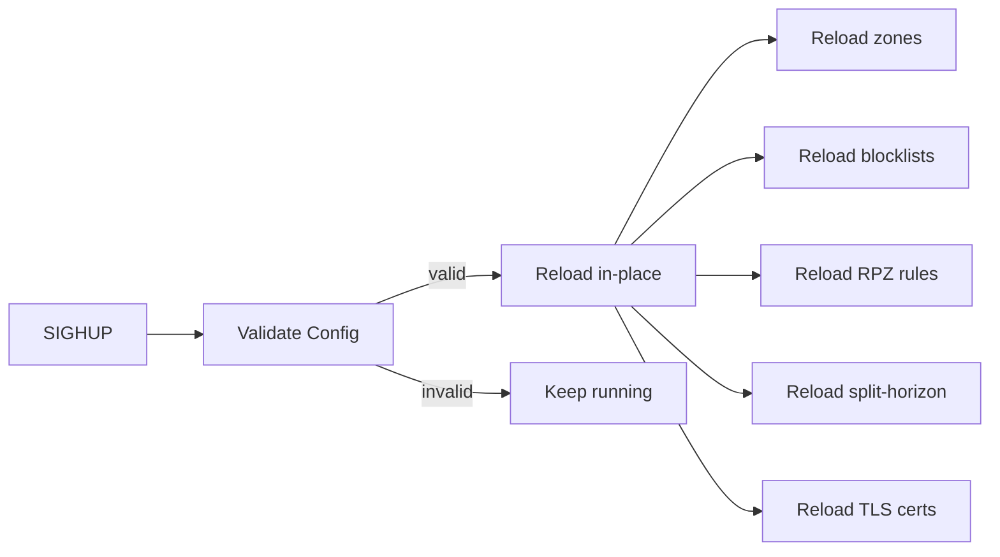

### Metrics (Prometheus)

- Query counters by type
- Cache hit/miss counters
- Latency histograms
- Transport stats (UDP/TCP packets, connections)
- Cluster metrics aggregation

### OpenTelemetry Tracing

- Span creation for each DNS query
- Attributes: qname, qtype, cache_hit, rcode
- HTTP middleware for API request tracing

### Audit Logging

- Query audit logging
- Reload audit logging
- File output with rotation support

### Memory Monitoring

- Runtime memory monitoring
- `CacheEvictor` for memory pressure response
- OOM protection

### Embedded Dashboard

- React 19 SPA served from `static/dist/`
- WebSocket endpoint for real-time stats
- Login HTML fallback

---

## Key Interfaces

### Handler Interface

```go
type Handler interface {
    ServeDNS(w ResponseWriter, r *Request)
}
```

All transport servers (`UDP`, `TCP`, `TLS`, `DoH`, `DoQ`, `WebSocket`, `XoT`) accept a `Handler` and invoke `ServeDNS()`.

### ResponseWriter Interface

```go
type ResponseWriter interface {
    Write(*Message) error
    WriteMsg(*Message) error
    LocalAddr() net.Addr
    RemoteAddr() net.Addr
    Transport() string
    Truncate(*Message, int) error
}
```

### Zone Interface

```go
type Zone interface {
    GetSignature(*Question) *Message
    Find(*Question) []RR
}
```

---

## Data Flow Summary

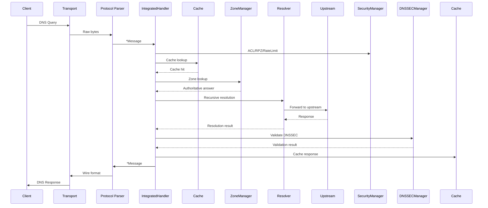

---

## Performance Optimizations

1. **Buffer pooling** — `sync.Pool` for zero-alloc packet processing
2. **Message pooling** — `sync.Pool` for DNS message reuse
3. **Compression map pooling** — Shared compression maps
4. **NSEC aggressive caching** — RFC 8198 negative caching
5. **Prefetching** — Popular queries nearing expiration
6. **SO_REUSEPORT** — Multi-core UDP scalability on Linux
7. **TCP pipelining** — 16 concurrent in-flight queries per connection
8. **Per-IP connection limits** — 10 per-IP, 1000 global

---

## Configuration

Default config path: `/etc/nothingdns/nothingdns.yaml`

Override with `--config` flag.

Validate config with `-validate-config` flag before reloading.