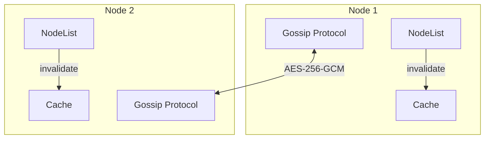

# Cluster Package

Gossip-based high-availability clustering with SWIM protocol and optional Raft consensus.

## Overview

Multi-node NothingDNS deployment with distributed state, cache synchronization, and zone replication.

## Architecture



## Consensus Modes

### SWIM (Default)

Gossip-based eventual consistency using SWIM (Scalable Weakly-consistent Infection-style Membership) protocol.

**Properties**:
- Failure detection via piggybacked heartbeat
- Dissemination via anti-entropy
- Configurable timeout and interval
- **Encryption mandatory** (VULN-005)

### Raft (Strong Consistency)

When `consensus_mode: raft` is set, uses Raft for:
- Zone update consensus
- Leader election
- Log replication

**Use case**: Critical operations requiring strong consistency.

## NodeList

Maintains cluster membership with health tracking:

```go
type Node struct {
    ID        string
    Addr      string
    State     NodeState  // Alive, Suspected, Dead, Draining
    Incarnation uint64
    Health    *HealthStats
    LastSeen  time.Time
}
```

### Health-Based Routing

`GetBest()` selects the healthiest node for load balancing:
- Weighted by `health.Weight`
- Penalized by error rate
- Favored by query throughput

## Gossip Protocol

SWIM protocol implementation in `gossip.go`:

### Message Types

```go
type GossipMessage struct {
    Type    GossipType
    SrcID   string
    DstID   string
    Payload interface{}
}

type GossipType int
const (
    Ping GossipType = iota
    Ack
    Alive
    Suspect
    Dead
    Update
)
```

### Payloads

```go
type CacheInvalidatePayload struct {
    Key    string
    Type   string
}

type ZoneUpdatePayload struct {
    ZoneName string
    Action   string  // full, add, delete
    Serial   uint32
    Records  []ZoneRecord
}

type ClusterMetricsPayload struct {
    QueriesTotal, QueriesPerSec float64
    CacheHits, CacheMisses     uint64
    LatencyMsAvg, LatencyMsP99 float64
}
```

## Encryption

All gossip messages encrypted with AES-256-GCM:

```go
type EncryptedMessage struct {
    Nonce   [12]byte
    Cipher  []byte
    Tag     [16]byte
}
```

**VULN-005**: Cluster refuses to start multi-node without `encryption_key` configured.

## Configuration

```go
type Config struct {
    Enabled       bool
    NodeID        string
    BindAddr      string
    GossipPort    int
    Region        string
    Zone          string
    Weight        int
    SeedNodes     []string
    ConsensusMode string  // "swim" or "raft"
    EncryptionKey []byte
    CacheSync     bool
}
```

## Cache Synchronization

When `cache_sync: true`:

1. **Local invalidation**: `InvalidateCache(key)` removes local entry
2. **Broadcast**: Gossip broadcasts `CacheInvalidatePayload` to all nodes
3. **Receive**: Nodes remove matching entries from their caches

## Cluster Manager API

```bash
# Cluster status
GET /api/v1/cluster/status

# Node list
GET /api/v1/cluster/nodes

# Node metrics
GET /api/v1/cluster/nodes/{node_id}/metrics
```

## Failure Detection

SWIM failure detection timeline:

1. **Alive** → Node responding to pings
2. **Suspected** → No ping ACK received (timeout)
3. **Confirmed** → Indirect confirmation from k nodes
4. **Dead** → Removed from cluster after confirmations

## Split-Brain Prevention

- Network partition detection via quorum
- Read operations fail if no quorum
- Write operations require quorum
- Automatic recovery when partition heals

## Raft Integration

For strong consistency needs (`internal/cluster/raft/`):

- Leader election
- Log compaction (snapshots)
- Linearizable reads
- Membership changes