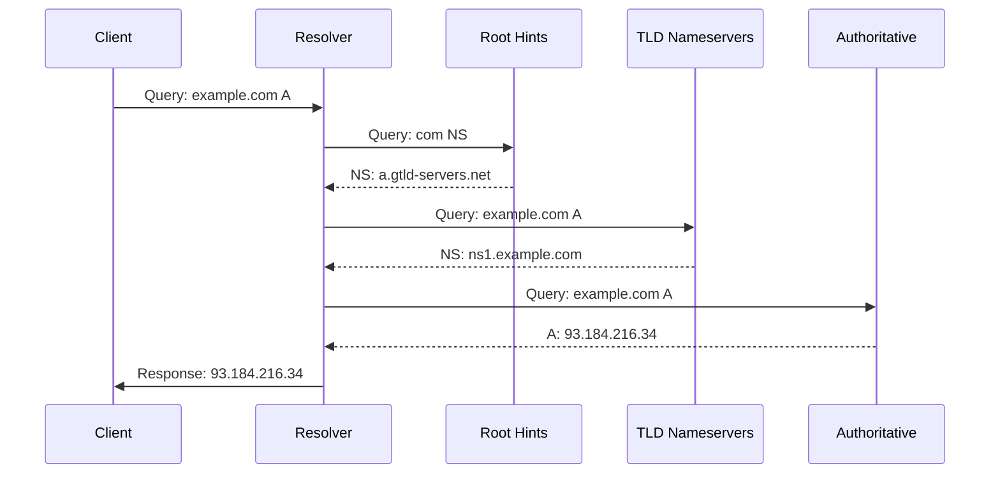

# Resolver Package

Iterative recursive DNS resolver with QNAME minimization and 0x20 encoding.

## Overview

Full recursive resolution engine for resolving arbitrary domain names by walking the DNS tree from root to leaf.

## Resolution Flow



## Configuration

```go
type Config struct {
    MaxDepth          int      // Max recursion depth (default: 30)
    MaxCNAMEDepth     int      // Max CNAME chain (default: 10)
    Timeout           time.Duration
    EDNS0BufSize      uint16   // EDNS0 UDP buffer (default: 1232)
    QnameMinimization bool     // RFC 7816 (default: true)
    Use0x20           bool     // 0x20 encoding (default: false)
    Hints             []*ResolverHint
}
```

## QNAME Minimization (RFC 7816)

Sends minimal query to each resolver:

```
Normal:     example.com A
Minimized:  com A
            ↓
            example.com A
            ↓
            (response from authoritative)
```

**Privacy benefit**: Each resolver only sees the minimal amount of information needed.

## 0x20 Encoding

Randomizes case in query name for spoof resistance:

```
Original:  example.com
Encoded:   ExAmPlE.CoM  (random case bits)
```

Client must match case on response, making DNS poisoning harder.

**Limitation**: Only works for ASCII domain names.

## CNAME Chasing

Follows CNAME chains within configured depth:

```
example.com → CNAME → www.example.com → A → 93.184.216.34
```

Stops if:
- Max CNAME depth reached
- Cycle detected
- Non-CNAME answer found

## Root Hints

Default embedded root hints from IANA. Can override:

```go
type ResolverHint struct {
    Name string
    Type uint16
   Addr string
}
```

Or via config:
```yaml
resolver:
  root_hints_file: /etc/nothingdns/root.hints
```

## EDNS0 Handling

- Sets UDP buffer size in outgoing queries
- Respects server's UDP size advertisement
- Handles proxy EDNS0 options (Client Subnet, etc.)

## Transport

Resolver uses `ResolverTransport` wrapping upstream client:

```go
type ResolverTransport struct {
    client       *upstream.Client
    loadBalancer *upstream.LoadBalancer
    config       *Config
}
```

Features:
- TCP fallback for large responses
- Connection pooling for TCP
- Response timeout per query

## Stale Cache Fallback

When upstream query fails:
1. Check stale cache for matching entry
2. If found and within ServeStaleTTL, return stale response
3. Increment `StaleHits` metric

## Security Features

- **VULN-059**: TXID re-randomized on each upstream query
- Response ID validated against query ID
- Servfail on validation failure
- DNSSEC validation when enabled

## Performance Considerations

- Queries serialized by resolver (depth-first)
- Concurrent resolution only for separate branches
- Prefetch popular domains nearing expiration
- Cache successful resolutions

## Integration

Used by `integratedHandler` when `resolver.enabled: true`:

```go
// In handler.go ServeDNS
if h.resolver != nil && !cacheHit {
    answer, err := h.resolver.Resolve(ctx, qname, qtype, qclass)
}
```